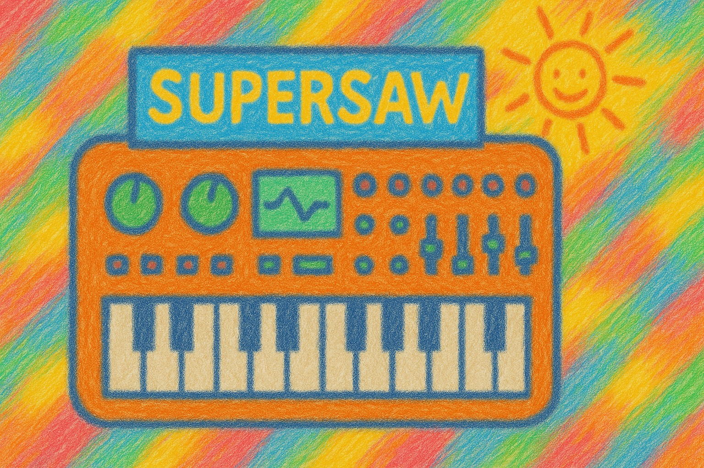

# jpvoice - DEMO: Inspired by the architecture of the Roland JP-8000 voice.

I actually just wanted to delve a little deeper into DSP. Since I've always wanted to have a Pure Data Supersaw on the Critter & Guitari Organelle M, I built one. I used the Roland JP-8000 as a model. Without knowing what I was getting into, it's a far cry from the original (it has almost probably nothing to do with it sonically), but I'm still quite happy with the sound. And I have now completed a very steep learning curve. Personally, I find the Supersaw pretty official.

I started with mathematical oscillators, only to realize that with the number of voices and filters on the Raspbian 3, that really wasn't an option. The code is still in the repo, but I then had to switch to wavetable with Fourier generation.

The biggest challenge was creating a nice-sounding filter that also worked efficiently. I first tried [bob~]. But with up to six voices in stereo, that would have required 12 [bob~]s. Not an option on the Organelle/Raspbian 3. But I've managed to create a pretty nice and efficient Sallen-Key low-pass filter with a nonlinear, analog-sounding feedback. Its design is not dissimilar to the filter on the Korg MS20. It's now integrated directly into the voice and can be controlled via an audio rate inlet for cutoff and reso.

There are still a few things I can do to optimize performance and memory. I'll work on that later. But it's currently running pretty stable. I'll finish a complete synth when I get a chance. The goal is to make it run on the Raspberry Pi 3.

Have fun with the prototype.

Organelle version: https://github.com/attackallmonsters/jpvoice/tree/main/bin/linux_arm

Linux desktop version: https://github.com/attackallmonsters/jpvoice/tree/main/bin/linux_x64

For the desktop version, you should copy the "tables" folder to the user's home directory. If this folder doesn't exist, the used wavetables will be recalculated and saved there. This takes a moment, but isn't critical on the desktop. Afterward, only the wavetable data will be loaded, which is much faster. Just start the patch by opening main-oui.pd, what is a simulation of the Organelle M user interface. You can get this here if you are interesseted in developing for the Organelle on the desktop: https://patchstorage.com/organelle-ui-for-desktop/

I'm not familiar with the JP-8000 at all, and I don't know what it sounds like. But the sound synthesis, with its rather simple means, offers a wide variety of tonal possibilities. The people at Roland are brilliant. And here modulation options aren't even implemented yet. But that might come later. If I have the opportunity to buy a JP-8000, I would definitely do so.

And as for the operation: just experiment. It is best to use an external keyboard.

Have fun!